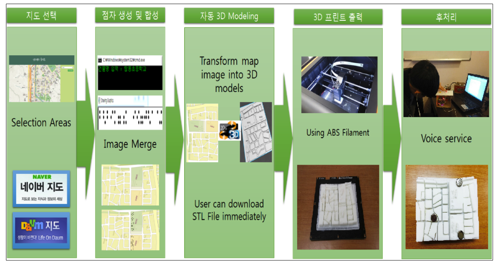

# 시각장애인을 위한 휴대용 촉지도 - 인스턴스 촉지도
## 목차
* [1. 작품명](#index1)
* [2. 작품의 목표](#index2)
* [3. 3D 프린팅 제작 과정](#index3)
* [4. 작품 설명](#index4)
* [5. 작품의 우수성 및 기대효과](#index5)
- - -
### 1. 작품명
* 인스턴스 촉지도
### 2. 작품의 목표
* 음성 안내 및 점자가 인쇄된 3D 촉지도를 통한 시각 장애인의 이동 편의성 개선
### 3. 3D 프린팅 제작 과정
* 지하철 등에 비치된 기존의 촉지도를 소형화하여 휴대성을 개선하면 시각 장애를 가진 사람들이 보다 안전하게 어디든지 이동할 수 있지 않을까 하는 생각에서 고안
* 대학교 산학 협력단에 비치된 3D 프린터 UPBOX와 재료 ABS 필라멘트를 사용
* Web Client를 통해 네이버 지도를 제공하고 버튼을 클릭하면 해당 위치의 지도 이미지가 서버로 전송,  VB.NET으로 작성한 Image To STL 툴과 Braille To Image 툴을 통해 3D 모델링 파일 제공 및 3D 프린터로 건물 위에 점자가 합성된 촉지도 출력
* 촉지도에 라즈베리파이와 Makey Makey를 연동하여 음성 안내 기능 제공
### 4. 작품 설명

* Image To STL 툴과 Braille To Image 툴, 웹 서버와 웹 클라이언트 개발
* 상기 툴을 이용하여 지도와 점자 이미지 합성, 3D 모델링 STL 데이터 새엇ㅇ
* 촉지도를 라즈베리파이와 연동, 음성 합성 서비스를 통한 음성 안내 구현
* 기존 촉지도는 크기가 크며 시각 장애인 개인에게 맞춤화 된 제품은 없음
* 3D 프린터와 다양한 ICT 기술, 복지 분야의 연계를 통하여 시각 장애인이 누려야 할 권익 증진 및 독립 도모
* 시각 장애인의 외출 및 이동 시 잛은 시간 안에 촉지도를 출력, 휴대 가능
### 5. 작품의 우수성 및 기대효과
* 공공기기관 등 기존의 촉지도는 찾는 것도 어려우나 인스턴스 촉지도는 휴대가 가능
* 기존 촉지도의 가격보다 대략 90% 저렴, 제품의 리드타임이 짧으며 적시생산 가능
* 3D 모델링 파일 생성, 점자 이미지 생성, 음성 안내 등의 각 부분을 모듈로 설계하여 수요자의 요구에 유연하고 즉각적인 대응이 가능하며, 각 모듈을 활용하여 시각 장애인을 대상으로 한 3D 프린팅 파생 제품을 생산할 수 있을 것으로 기대
* 민,관간의 복지 사업 및 정책의 일환으로 도입하여 시각 장애인의 권익 증진 도모
* 4차 산업혁명의 핵심인 3D 프린터의 복지 산업 도입과 시각 장애인 생활용구 제작
### 시연 동영상
* [https://youtu.be/ttukfMC7cfU](https://youtu.be/ttukfMC7cfU)
